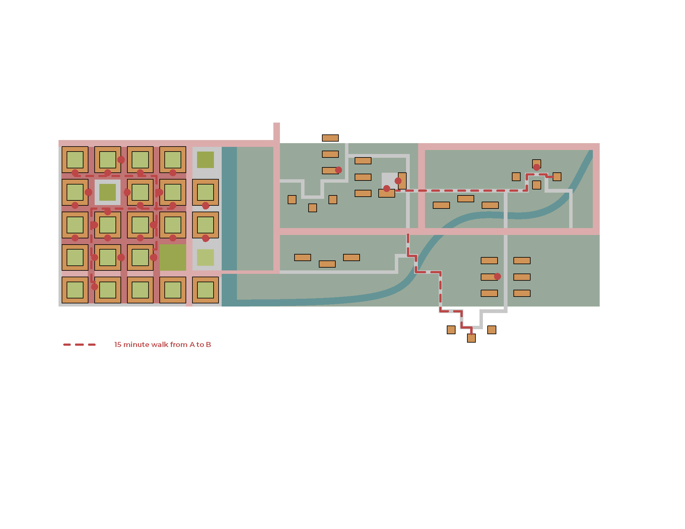

<!--
  context_1.pdf and analysis_1.pdf aren't included below since PDFs
  can't render inline yet - export the relevant page(s) as JPG/PNG if
  you want them shown, or ask for a "Download" link instead.
-->

## Context

Many of Gothenburg's suburban areas face challenges such as social exclusion, car dependency, and poor connectivity within the urban street network. This thesis explores how the Evolutive Meshed Compact City (EMC²) concept can guide sustainable densification by focusing development along existing suburban main streets.

## Methods

Recognizing the ecological value of suburban woodlands, the project examines how urban growth can balance density with biodiversity and ecosystem preservation. Through data-driven analyses of the street network and the suburban green–blue networks, the study identifies how proximity, connectivity, and ecological functions interact — using QGIS-based tools built by Chalmers' Spatial Morphology Group (SMoG) to map human movement and wildlife habitat connectivity across the same suburban area, side by side.

## Outcomes

The result is a social–ecological case study revealing synergies and conflicts between urban and natural systems in Gothenburg's periphery. One key finding: the streets that are busiest and best-connected aren't always the ones closest to shops, transit, and everyday amenities — a mismatch that complicates any simple "just add density here" approach.

Building on that finding, the thesis proposes a redesigned network of main streets for the area, plus a detailed design for one of them: Kvibergs bäckväg, a street crossing the Kvibergsbäcken stream. The proposal shown above turns that crossing into a shared social and ecological space — a boardwalk with recreational seating and room for informal, outdoor use, positioned to stay out of the way of the stream's ecological function rather than displacing it.

## Reflection

Ecological research tends to focus on species that are well documented and easy for people to notice and relate to — the lesser spotted woodpecker was one of three species studied here. Capturing ecological value more fully means looking beyond what's visible, to the fuller range of species and senses through which a place is actually experienced. The thesis also points to the importance of including human residents as stakeholders alongside the non-human species it modeled, since different communities can perceive and value ecological richness differently.

Supervised by Ioanna Stavroulaki, examined by Meta Berghauser-Pont, at Chalmers School of Architecture — with thanks to Chalmers' Spatial Morphology Group (SMoG) for the research and data this thesis builds on.
